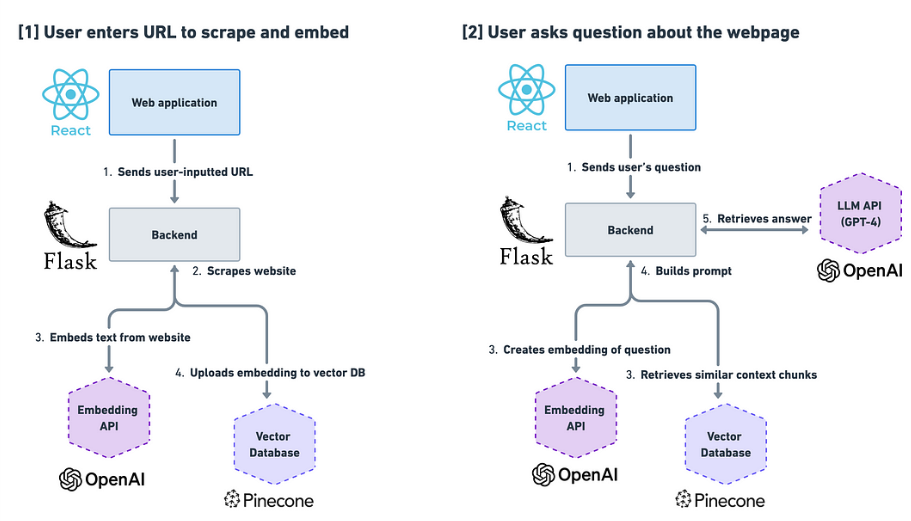

# Full_Stack_LLM Q&A

**__Full-stack LLM application with OpenAI, Flask, React, and Pinecone__**

This is a sample application built to allow a user to input a URL and ask questions about the content of that webpage. It demonstrates the use of **Retrieval Augmented Generation**, **OpenAI**, and **vector databases**.

## Architecture


## Components of the full application:
* **Backend (Flask)**: This handles the logic to scrape the website and call OpenAI's Embeddings API to create embeddings from the website's text. It also stores these embeddings in the vector database (Pinecone) and retrieves relevant text to help the LLM answer the user's question.
* **OpenAI**: We'll call two different API's from OpenAI: (1) the Embeddings API to embed the text of the website as well as the user's question, and (2) the ChatCompletions API to get an answer from GPT-3 to send back to the user.
*  **Pinecone**: This is the vector database that we'll use to (1) send the embeddings of the website's text to, and (2) retrieve the most similar text chunks for constructing the prompt to send to the LLM in step 3.
*  **Frontend (React)**: This is the interface that the user interacts with to input a URL and ask questions about the webpage.
*  **SocketIO**: To allow communication between Frontend and Backend

## Setup

### Create .env file
```
OPENAI_API_KEY=<YOUR_API_KEY>
PINECONE_API_KEY=<YOUR_API_KEY>
```

### Start the app
```
docker-compose up --build
```

## Documentation

### Embeddings
https://platform.openai.com/docs/guides/embeddings

### RAG (What Is Retrieval-Augmented Generation ?)
https://blogs.nvidia.com/blog/what-is-retrieval-augmented-generation/

